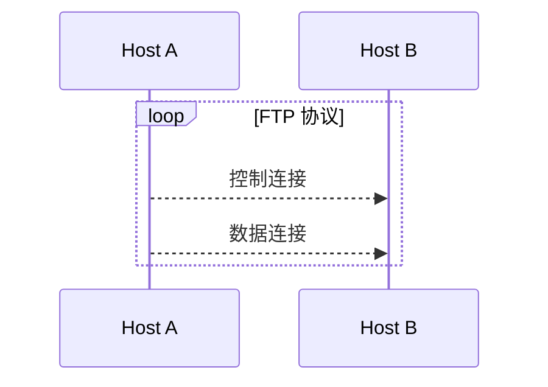
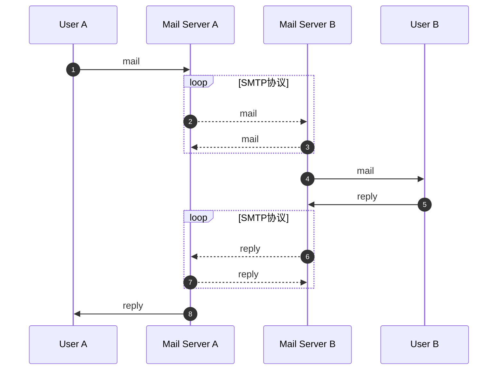
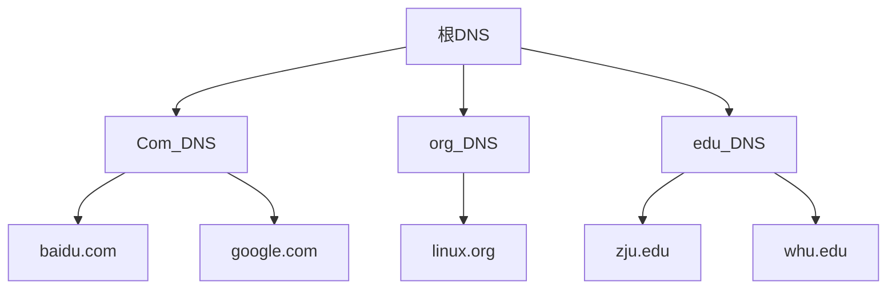
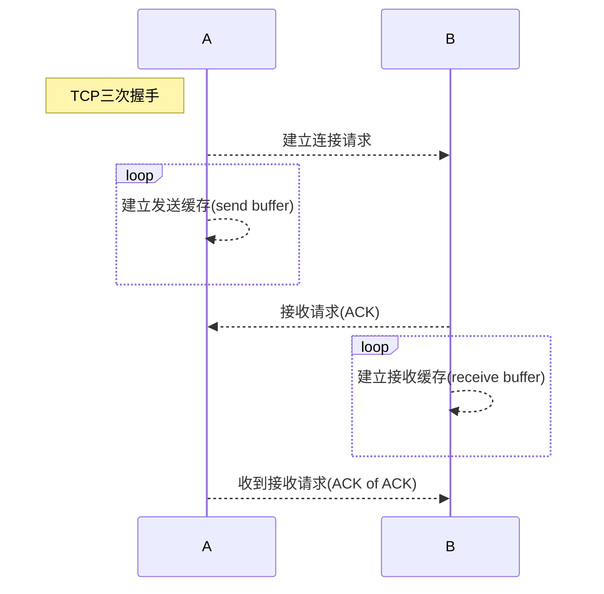
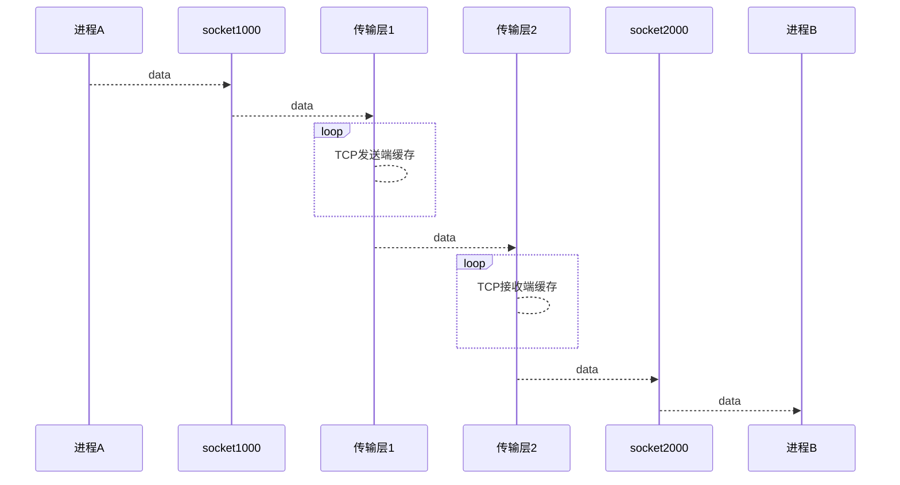
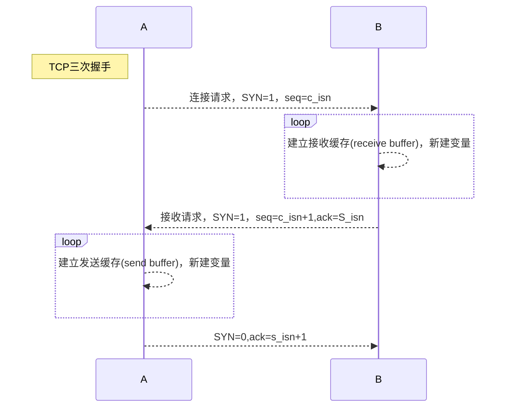
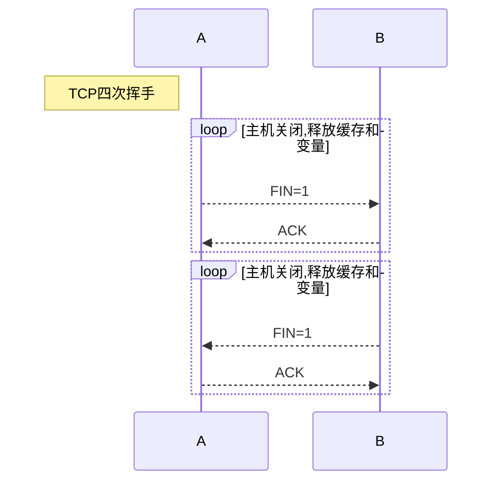
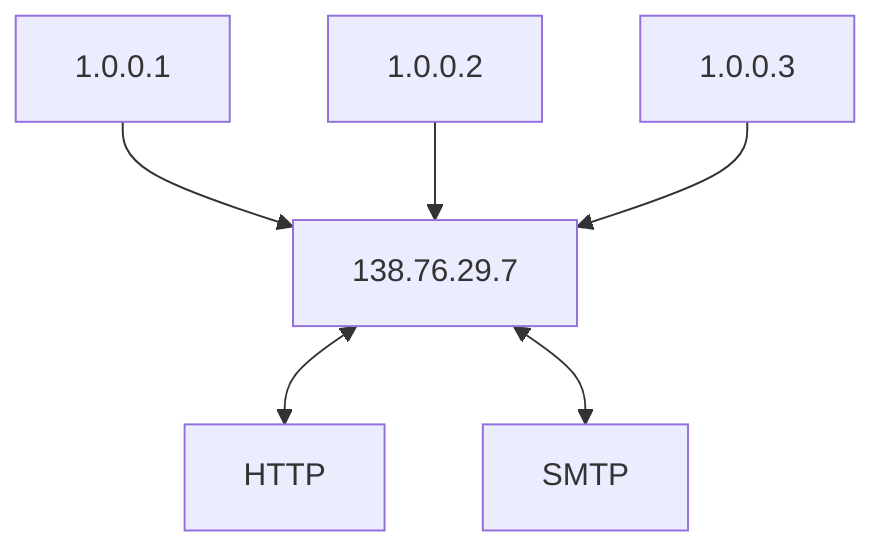

# 计算机网络


[toc]


# 1， 计算机网络和因特网


## 1.1，什么是因特网


​	因特网的构成可以分为两种方式来定义：1，根据组成网络的基本硬件和软件。2，根据为分布式应用提供服务的联网基础设施来描述因特网。


### 1.1.1 因特网的具体构成


* **因特网**是一个世界范围内的**计算机网络**
* 每个联网的设备我们称之为**终端**（end system）或者**主机**（host）
* 终端通过**通信链路**（communication link）和**分组交换机**（packet switch）连接到一起
  * 不同的通信链路，传输速度不一样
  * 把发送的数据分段，并且给每一段加上包头，这种技术我们称之为**分组**（packet）
* **路由器**（router）和**链路层分组交换机**（link-layer switch）是当前两种最著名的分组交换机
* **路径**（path）是描述从发送端到接收端经过的一系列通信链路和分组交换机
* **因特网服务提供商**（ISP）是提供终端接入互联网的服务商
* 终端，分组交换机和其他设备都要运行一系列的**协议**，这些协议是用来控制发送和接受的，例如**TCP**（Transmission Control Protocol）和**IP**（Internet Protocol）
* 协议存在的意义在于，可以使人类以一个共同的标准进行协同工作，常见的标准有**互联网标准**（Internet Standard）和**互联网工程任务组**（Internet Engineering Task Force，IETF）
* IETF的标准文档称作**请求评论**（Request For Comment，RFC）


### 1.1.2 因特网的服务描述


​	我们也可以从为各种应用程序提供服务的基础设施设备来描述互联网：

* **分布式应用程序**（disturbed application）：需要涉及多台相互交换数据沟通的终端设备来运行的程序，即应用程序运行在终端上，而非服务器上。例如：电子邮件，VoIP等等。
* **互联网**在应用程序的层面上可以理解为：为互联网程序提供服务的平台。
* **应用程序编程接口**（Application Programming Interface，API）：是为因特网中终端设备提供向另外一个终端的软件交换数据的方式。


### 1.1.3 什么是协议


* **网络协议**（protocol）：一个**协议**是定义了两个或者多个通信实体之间交换报文（message）的格式和次序，以及报文发送和接收之后采取的一系列动作。


## 1.2 网络边缘


​	网络边缘是处于终端的设备和软件应用。

* **物联网**：将多种设备通过网络连接在一起组成的网络，我们称之为物联网
* **主机**（host）：我们可以分为客户端和服务器两种类型
  * **客户端**（client）：非正式的等于个人电脑，个人手机等等主机
  * **服务器**（server）：非正式等于性能更强大的主机设备，用来储存数据，中继数据等等


### 1.2.1 接入网


​	我们定义**接入网**为，将终端设备连接到**边缘路由器**的物理链路。

* **DSL**（Digital Subscriber Line）：通常由电话通信商提供ISP，和电话网络绑定在一起
* **FTTH**（Fiber To The Home）：光纤到户，更高效的接入网
  * **主动光纤网络**（Active Optical Network， AON）
  * **被动光纤网络**（Passive Optical Network，PON）：用户通过**光纤网络终端器**（Optical Network Terminator，ONT）用光纤连接到附近的**分配器**（splitter），再连接到中心局的**光纤线路端接器**（Optical Line Terminal，OLT）其中OLT提供了光电信号的转换。

* **企业接入网**：利用**局域网**（LAN）将用户接入到边缘路由器。
* **广域无线接入网**（3G，LTE，A-LTE，NR）：为移动用户提供接入到因特网的接入网。


### 1.2.2 物理媒体


* 双绞铜线
* 铜轴电缆
* 光纤
* 陆地无线电信道
* 卫星无线电信道


## 1.3 网络核心

​	定义：由互联网终端的分组交换机和链路构成的网络就叫做网络核心。

### 1.3.1 分组交换


* **报文**（message）：网络中的终端互相交换的信息。
* **分组**（packet）：将一个报文划分为比较小的数据块。
* **储存转发传输**：是指分组交换机在发送一个分组时，必须完整的接收到这个分组才能进行发送。
* **排队时延和分组丢失**：分组交换机有一个**输出缓存**（output buffer），用来存放待发送的分组数据。**排队时延**（queue delay）指的是等待的数据包所需要的承受的输出缓存时延。
* **分组丢包**（packet lost）：指的是在网络拥堵的情况下发送分组数据的丢失。
* **转发表**和**路由选择协议**：转发表（forwarding table）是存在于路由器中，用于将数据根据IP地址转发到下一个路由器或者地址的表格。路由选择协议（routing protocol），是用来自动设置转发表，由此来得到最短的转发路径。


### 1.3.3 电路交换


​	和分组交换一样，电路交换也是一种提供数据在网络中传输的方式。

* **电路交换**：通常**预留**了一定的网络资源（缓存和传输速率），在分组交换中这种资源通常是**不预留**的。
* 电路交换的**频分复用**（Frequency-Division Multiplexing，FDM）和**时分复用**（Time-Division multiplexing，TDM）。
  * FDM，频谱一般是共享的，为每一个链路分配一个单独的子频段。
  * TDM，时间被分配为固定的多个帧，为每个链路分配单独的帧来传输数据。


> ​	电路交换和分组交换相比较：
>
> 1. 分组交换拥有较灵活的带宽分享
> 2. 分组交换拥有更低的成本
> 3. 电路交换拥有专门预留的缓存和传输速率，因此更稳定


### 1.3.4 网络的网络


​	将全球的ISP连接到一起，形成世界范围连接的网络，就称作网络的网络。


## 1.4 分组交换网络中的延时，丢包和吞吐量


### 1.4.1 分组交换网络的时延概念


* **节点处理延时**（Nodal Processing delay）：分组交换机查询分组头，并决定该往哪发送分组数据产生的延时。

* **排队延时**（queuing delay）：在分组数据发送时，由于数据排队发送而产生的延时

* **传输延时**（transmission delay）：将所有分组数据发送完的延时

* **传播延时**（propagation delay）：节点A到B所需要的传播时间，就是传播延时

  

### 1.4.2 排队时延和丢包


* 排队延时：略
* 丢包：当数据流量达到一定程度时，分组交换机无法储存数据包时，他会丢包


### 1.4.3 端到端时延


### 1.4.3 端到端时延


* tranceroute：这是一个在任何终端都支持的程序，它会向每一个路由器发送一个特殊的报文，当路由器接收到这个报文时会向主机回复一条报文（包括了路由器到主机的时间信息）


### 1.4.4 计算机网络的吞吐量


​	为了测试网络设备的性能，我们通常会测试他的**瞬时吞吐量**。


## 1.5 协议层次及其服务模型


### 1.5.1 分层的体系结构


* **协议分层**（layer）：为了给网络协议提供一个结构，网络设计者通过分层的方式来定义和实现网络协议。
* **协议栈**（protocol stack）：将**各个层所有的**协议综合起来就是成为协议栈。


​	五层网络协议栈（自顶向下）

| 分层   | 功能                                                         |
| ------ | ------------------------------------------------------------ |
| 应用层 | 应用层是网络程序和他们协议存留的地方。例如，**https，ftp，smtp**协议都是应用层协议。多用于终端系统上。 |
| 运输层 | 传输层是在**应用程序的端口**之间传输应用层的报文。例如**TCP**协议和**UDP**协议。传输层的分组数据成为**报文段**（segment） |
| 网络层 | 网络层的数据称之为**数据报**（datagram），网络层的把数据从一个主机发送到另一个主机。例如**IP协议**就是网络层的协议，其中运输层的tcp、udp协议会将ip地址告知网络层，这样网络层就能给对端协议传输数据。 |
| 链路层 | 链路层是将分组数据从一个网络节点（可以是主机，路由器）发送到下一个节点。例如**以太网，WiFi，DOCSIS协议**等等就属于链路层协议。我们称链路层的数据为**帧**。 |
| 物理层 | 物理层的任务是将链路层的**帧**的每个**比特**传送到下个节点。物理层根据传输的媒介不一样，协议也会不一样，例如光纤和铜缆线的结构就不一样。 |


 七层OSI模型：应用层、**表示层、会话层**、传输层、网络层、数据链路层和物理层。

| 分层   | 功能                                                         |
| ------ | ------------------------------------------------------------ |
| 表示层 | 表示层的作用是使通信的应用程序能够解释交换数据的含义。例如：数据压缩，数据加密，数据描述等等功能。 |
| 会话层 | 会话层提供了数据交换的界定和同步功能，例如：包括了建立检查点，和恢复方案的方法。 |


### 1.5.2 封装


​	

| 主机（source）          | 链路层交换机           | 路由器    | 目标（target）          |
| ----------------------- | ---------------------- | --------- | ----------------------- |
| 应用层（M）报文         |                        |           | 应用层（M）报文         |
| 传输层（H1+M）报文段    |                        |           | 传输层（H1+M）报文段    |
| 网络层（H2+H1+M）数据报 |                        | 网络层    | 网络层（H2+H1+M）数据报 |
| 链路层（H3+H2+H1+M）帧  | 链路层（H3+H2+H1+M）帧 | 链路层    | 链路层（H3+H2+H1+M）帧  |
| 物理层    ------>       | 物理层    ------>      | 物理层--> | 物理层                  |


封装概念： 一个**应用层报文** M（message）被传送到**传输层**。会被加上一个H1的传输层的头信息，并形成**报文段**（transport-layer segment）。


* H1，传输层报文：加入了检错信息，和允许传输信息。
* H2，网络层报文：加入了源IP地址和目的IP地址
* H3，链路层的头部信息。


# 2，应用层


​	应用层的协议是设计服务网络应用程序的，如果没有网络应用程序，那么应用层协议也将会没有意义。


## 2.1 应用层协议原理


* 应用层的程序是运行在终端上的（用户终端或者服务器）
* 应用程序的开发者不必要为网络设备编写程序，因为网络设备的协议都是处于底层协议
* 用户终端可以是linux，MAC OS，windows等不同的操作系统。
* 编写的程序也可以是JAVA，C，Python等多种编程语言。
* 因此应用层的软件受限于终端系统，而不受限于网络，这样子利于软件的开发


### 2.1.1 网络应用程序体系结构


* 对于应用程序的开发者来说，一般认为网络体系结构是不变的。
* **应用程序体系结构**：是开发者设计的一种程序体系，他规定了软件如何在端系统中组织。
  * **客户-服务器体系结构**（client-sever architecture）：一个常开的主机作为服务器，它服务于多个客户主机的请求。
    * 服务器通常有一个固定的IP
    * 客户之间不会直接通信，需要通过服务器
    * Web，FTP，Telnet，SMTP都是CS架构
  * **P2P体系结构**（P2P architecture）：P2P通常对服务器依赖很小，或者没有。每个用户之间都是对等方。
    * 客户直接或者间接的和其他客户直接通信
    * 对服务器的依赖很小，或者没有
    * **自扩展好**（self-saclability）：每个对等的主机对于系统都在分发文件，增强了系统的服务能力。
    * 缺点：安全性差，ISP不友好（P2P增加了上传的压力），需要用户支持


### 2.1.2 进程通信


​	在编写网络程序之前，我们需要了解不同的终端系统里的程序是如何通信的。事实上不同的程序是通过**进程通信**的，这里我们只关心不同终端之间的通信。

​	我们可以认为进程是一个运行中的程序。


​	客户和服务器进程：

> 1. 通常进程通信需要存在一个**进程对**
> 2. 一个进程对中，总有一方是**客户**，另一方是**服务器**
> 3. 发送进程被标识为**客户端**，等待接受响应的进程是**服务端**
> 4. P2P结构下的对等客户，既可以是客户端也可是服务端


​	进程和计算机网络之间的接口

> 1. 进程之间的通信需要一个接口来实现
> 2. **套接字**（socket）：是应用层和传输层的接口（API），它可以把报文从应用层传送到传输层，传输层再送到网络层，最后送达目标主机的套接字，然后通过套接字给应用层。
> 3. 应用层可以选择传输层的协议（TCP/UDP）等。
> 4. 应用层可以选择少量传输层参数（缓存，长度等等）


​	进程寻址：

> 1. 为了可以给一个进程发送分组数据，我们需要知道对端的地址（IP）
> 2. 为了给对端的指定进程发送分组数据，我们还要知道对端进程的地址（端口，port）


### 2.1.3 可供应用程序使用的传输服务


​	应用层可以根据对于分组数据传输的需求选择相应的传输层协议。


* **可靠性数据传输**（Reliable data transfer）：在传输一些重要分组数据的时候，需要保证数据的可靠性，在某些场景下则不需要，例如看一段视频流。
* **吞吐量**：网络的带宽是波动的，不同应用对带宽的需求是不一样的，这影响到传输速率
* **定时**：保证数据的延时处于一定范围内
* **安全性**：保证分组数据的安全，进行加密和解密等等操作


### 2.1.4 因特网提供的传输服务


​	计算机网络一般为软件提供传输层的服务。一般是TCP、UDP协议。一般情况下我们在新建一个应用时，我们需要从需求考虑选择一种传输层的协议。每个应用都有着不同的需求，如下所示。


| 应用             | 数据丢失 | 带宽                          | 时间敏感  |
| ---------------- | -------- | ----------------------------- | --------- |
| 文件传输（FTP）  | 不能     | 弹性                          | 不        |
| 电子邮件（SMTP） | 不能     | 弹性                          | 不        |
| Web文档（HTTP）  | 不能     | 弹性                          | 不        |
| 视频电话（VoIP） | 容忍丢失 | 音频（几kbps）/视频（几Mbps） | 是，100ms |
| 储存音频/视频    | 容忍丢失 | 同上                          | 是，几秒  |
| 交互式游戏       | 容忍丢失 | 几kpbs                        | 是，100ms |
| 及时信息         | 不能     | 弹性                          | 是        |


####	**TCP**协议：此协议服务模型包括面相连接服务和可靠性数据传输服务。通常有以下特性：

> 1. **面相连接服务**：在传送分组数据之前，客户端和服务端会交换相互的传输层信息，这个过程称之为**握手**。在握手完成之后，一个**TCP连接**就在两个进程的套接字之间建立了。数据可以在这个连接上相互传输数据（即全双工传输模式），在应用程序传输玩分组数据之后，连接就被拆除。
> 2. **可靠数据传输服务**：通信进程之间依靠TCP可以无差错，按顺序的交付所有分组数据。
> 3. **流量控制**：当网络存在拥塞的时候，TCP会抑制发送端发送数据，这样可以减轻对网络系统的压力。


​	**Note**：

* 利用TCP传输的数据都是在网络中以**明文的形式传输**的，也就是说TCP协议没有加密和解密的功能。
* 因此研发出了TCP的加强版**安全套接字层**（Secure Sockets Layer，**SSL**）
* 注意，SSL并**不是在传输层上实现**的，是在应用层实现的
* 数据首先经过SSL加密，在通过API传输给TCP
* 如果要使用SSL，那么发送端和接收端的进程都需要支持SSL相关的库资源


####	**UDP**协议：是不提供非必要服务的传输协议，是一种轻量级的传输协议，通常有以下特性：

> 1. **UDP 是无连接的**，也就是没有握手过程
> 2. **UDP不提供可靠数据传输**
> 3. **UDP不保证数据包的到达顺序**
> 4. **UDP没有拥塞控制功能**


​	传输层不提供的服务：


* 吞吐量
* 定时（时延）


| 应用          | 应用层协议                         | 选择的传输层协议 |
| ------------- | ---------------------------------- | ---------------- |
| 电子邮件      | SMTP [RFC 5321]                    | TCP              |
| 远程终端访问  | Telnet/SSH [RFC 854]               | TCP              |
| Web           | HTTP [RFC 2616]                    | TCP              |
| 文件传输      | FTP [RFC 959]                      | TCP              |
| 多媒体流      | HTTP                               | TCP              |
| 语音通话 VoIP | SIP[RFC 3261]，RTP[RFC 3550]，SKPE | UDP或者TCP       |


###  2.1.5应用层协议


​	应用层协议（Application-layer protocol）定义了运行在不同的端系统上的应用程序如何相互传递报文。


* 交换的报文类型：例如请求报文和响应报文
* 各种报文类型的语法：例如报文中各个字段是如何描述的
* 字段的语义：这些字段包含的信息含义
* 一个进程何时，如何发送报文，以及对报文的响应类型


### 2.1.6 本书涉及的网络应用


* Web（HTTP）
* 文件传输（FTP）
* 电子邮件（SMTP）
* 目录服务（DNS）
* P2P


## 2.2 Web和HTTP


​	Web和HTTP可以是人类方便的在客户端上获取服务器的数据。他有许多优良的特性，例如，按需操作--在你想要获得数据时才去获取数据。


### 2.2.1 HTTP概况

​	

​	HTTP的定义：超文本传输协议（HyperText Transfer Protocol， HTTP），他是一种在浏览器和服务器之间交换报文的应用层协议，是互联网的核心。


​	相关WEB术语：

* **Web页面（Web Page）**：是由多个对象（object）组成的，多数都包含一个HTML基本文件。
* **对象（Object）**：可以是一个HTML文件，一个JPEG图片，一个JAVA程序，一个视频，他们通过一个URL寻址
* **URL是**用来对象寻址的，一般由两个部分组成，**主机名**和**路径**
* **Web浏览器**：例如FireFox和Chrome，实现了HTTP的客户端
* **Web服务器**：实现了HTTP的服务器端


​	HTTP概况

> 1. HTTP是基于TCP传输层协议的应用层协议
> 2. HTTP定义了Web浏览器和Web服务端如何进行报文交换
> 3. HTTP是**无状态协议**（stateless protocol），即他不会记忆用户的任何操作，也不会保存用户的信息
> 4. Web服务器总是打开的，IP总是固定的


### 2.2.2 非持续链接和持续链接


​	客户端和服务器在进行通信时有两种方式：

* 非持续链接：每次传输报文都会新建一个TCP链接，传输结束后TCP链接就会被拆除
* 持续链接：每次传输的报文都是通过同一个链接进行传输


​	**非持续连接的HTTP**：

> 1. HTTP客户端向服务端的进程的80端口发起TCP协议的连接请求
> 2. HTTP向客户端发送一个请求
> 3. HTTP服务端解析请求，并且回复一个响应给客户端
> 4. 服务端进程告知TCP断开连接
> 5. Web浏览器客户端解析响应并且呈现给用户，并且断开TCP


#### TCP三次握手


* **往返时间**（Round-Trip Time，RTT）的定义：一个数据包从客户端出发到达服务端，再回到用户端的时间。
* **三次握手**：**第一次握手**，客户端向服务器发送一个TCP小段报文。**第二次握手**，服务端向客户端回复一小段报文进行响应和确认。**第三次握手**，客户端向服务端发送一个确认


​	**持续连接的HTTP：**

> 1. 持续连接的HTTP比非持续的HTTP延时更短，因为少了TCP建立和断开的过程（RTT更少）
> 2. 非持续连接的HTTP服务器中需要存储更多的TCP变量和缓存，更耗费资源


### 2.2.3 HTTP报文格式


​	HTTP的规范RFC 1945和RFC 2616规定了HTTP的报文格式。


​	HTTP的报文主要分为两种：请求报文和响应报文


​	**HTTP的请求报文格式：**

> GET /path/file.jpeg HTTP/1.1
>
> Host: www.baidu.com
>
> Connection: Close
>
> User-agent: Mozilla/5.0
>
> Accept-language: Fr


* **请求行**（request line）：第一行就是请求行，主要由三个部分组成，方法字段，URL字段，HTTP版本字段
  * **方法字段**：包括了GET，POST，HEAD，PUT和DELETE方法
  * **URL字段**：包括了请求对象的标识
  * **HTTP版本字段**：标识着用的HTTP版本
* **首部行**（Header line）：第一行后面的我们称之为头部信息
  * **Host**：对象存在的地址
  * **Connection**：标识使用的是非连续链接，即在传输信息之后关闭TCP
  * **User-agent**：标识用户端的代理浏览器
  * **Accept-language**：标识用户希望得到什么语言版本的响应
* **实体主体**（Entity Body）：用户在使用POST方法时，实体主体可以是**单表**或者**报文**，例如我们在搜索网页的时候需要输入关键字，这时关键字就储存在实体主体之内。*Note：使用单表不一定要使用POST方法，GET方法也可以做到。*


​	**HTTP的响应报文格式：**

> HTTP/1.1 200 OK
>
> Connection: closed
>
> Date: Tue, 09 Aug 2011 15:44:04 GMT
>
> Server: Apache/2.2.3 (CentOS)
>
> Last-Modifed: ue, 09 Aug 2011 15:45:04 GMT
>
> Content-Length:6821
>
> Content-Type: text/html
>
>  
>
> data data data


* **初始状态行**（status line）：主要由三个部分组成，协议版本，状态码，状态信息
* **首部行**（header line）：
  * **connection**：告知用户，发送报文之后关闭TCP链接
  * **Date**：产生响应的时间
  * **Server**：指示服务器的信息
  * **Last-Modified**：指示既可以储存在客户端也可以储存在服务器的缓存（请求的数据上一次在服务器内修改的时间）
  * **Content-length**：指示数据的长度
  * **Content-Type**: 指示对象数据的类型
* **实体主体**（Entity Body）


####	常见的HTTP状态码


* 200 OK: 请求成功，数据在响应报文内
* 301 Moved Permanently： 请求对象已经被永久转移了，新的URL在Location中返回
* 400 Bad Request：一个通用的差错代码，表示该请求服务器不理解
* 404 Not Found： 请求的文档不在服务器上
* 505 HTTP Version Not Support：服务器不支持请求的http版本


### 2.2.4 用户与网络的交互：COOKIE


​	因为HTTP是无记忆的协议，如果一个服务器需要记住用户的操作，或者限制用户的操作，又或者想要识别用户，那么需要引进一个新的技术--COOKIE（RFC 6265），Cookie是服务器用来追踪用户的。


​	COOKIE的组件：

* 在HTTP响应中有一个COOKIE的首部行（header）
* 在HTTP的请求报文中也有一个COOKIE的首部行（header）
* 在客户端的系统保存有一个COOKIE文件，由浏览器管理
* Web服务端有一个后端数据库


> ​	在用户给客户端发送请求时，服务器端会回复一个响应并给用户分配一个id （set cookie）
>
> ​	用户的端系统会记录下这个id在cookie中，并且和这个服务器绑定起来
>
> ​	用户在接下来的请求中都会带有这个id，那么服务端就知道用户在何时做了何种操作


### 2.2.5 Web缓存


​	**Web缓存**（Web cache）定义：也称作**代理服务器**（Proxy Server），她是能够代表初始Web服务器来满足HTTP请求的网络实体。


* Web缓存服务器有自己的储存空间，用来缓存最近请求过的对象副本

* 客户端请求首先发往Web缓存服务器，如果请求的对象副本存在就给服务器回复响应

* 如果Web缓存服务器没有客户端请求的对象，这时Web缓存服务器会像服务器发起请求

* 通常Web缓存服务器由ISP提供，他可以减少用户对服务器的响应时间，减少服务器端的压力

* Web缓存服务器可以减少时延

  


​	

### 2.2.6 条件GET方法


​	但是Web缓存服务器存在一个问题，有时候Web缓存的对象副本可能是旧的数据。

​	HTTP存在一种机制，可以使Web缓存服务器验证他的对象是新的。就是条件GET方法


​	条件GET的使用方法：

* 请求报文使用GET方法
* GET方法的首部中包含If-Modified-Since


​	条件GET的工作原理：

* 用户想Web缓存服务器请求一个对象
* Web缓存服务器发现这个对象存在，但是需要和服务器通信确定这个对象不是旧的
* Web缓存服务器发送请求（包含If-Modified-Since:xxx）
* 如果文件没有被修改，那么服务器会给Web发送一个响应，状态码为304 Not Modified


## 2.3 文件传输协议：FTP


​	**FTP**(File Transport Protocol): 一个用户在主机上向另一个主机发送文件的协议。

* 为了访问远程主机，必须有一个用户标识和密码
* 为了访问远程主机还必须知道远程主机的地址
* FTP的进程端口号一般是21
* FTP一般会保存用户的**状态**
* FTP的详细文档[RFC 959]





> ​	FTP协议和HTTP协议不同的地方是，FTP使用两个TCP来传输文件，一个**控制连接**，一个**数据连接**
>
> ​	**控制连接**：是用来传输控制信令的，例如存放（PUT），获取（GET）等等
>
> ​	**数据连接**：是用来发送实际文件的TCP连接


​	HTTP是带内（In Band）传输协议，FTP是带外（带外）传输协议。


​	FTP的命令：

* 信令都是7个字节组成
* 信令是人类可读的ASCII码
* 常用信令
  * USER username：用于给服务器发送用户名标识
  * PASS password：用于给服务器发送用户密码口令
  * LIST：请求服务器当前远程目录的所有文件列表（在数据连接上传输）
  * RETR filename：用于检索（GET）远程主机目录上的文件
  * STOR filename：用于在远程主机上存放一个文件
* 常见响应
  * 331 Username OK， PASSword required	等待密码
  * 125 Data connection already open；transfer starting    开始传输数据
  * 425 Can't open data connection 无法打开数据连接
  * 452 Error writing file：写文件发生错误


## 2.4 互联网中的电子邮件


​	电子邮件系统的三个组成部分：

* **用户代理**（user agent）
* **邮件服务器**（mail server）
* **简单邮件传输协议**（Simple Mail Transfer Protocol，SMTP [RFC 5321]）
* 进程端口一般是25


### 2.4.1 SMTP




> ​	每个用户发送邮件时，先把邮件发送到服务器的**邮箱**上，邮箱服务器之间再转发到另一个邮箱服务器，这些邮箱服务器的协议就是**SMTP**，然后邮箱服务器再把邮件发送到对端主机。


### 2.4.2 和HTTP的对比


* HTTP是拉协议（Pull），在需要信息时向服务器发送数据请求
* SMTP是推协议（PUSH），服务器在用户连接上时，向用户推数据


### 2.4.3 邮件报文格式和MIME


​	邮件在发送时，在头部会包含一些时间，收件人和发件人的信息。


### 2.4.4 邮件访问协议


* **第三版邮局协议**（Post Office Protocol - Version3， pop3）
* **因特网邮件访问协议**（Internet Mail Access， IMAP）


## 2.5 DNS：互联网的目录服务


​	主机的名字叫做主机名（host name）：例如www.baidu.com

​	主机的地址（IP address）：10.144.2.5

​	

### 2.5.1 DNS提供的服务

​	

​	DNS提供的服务是把主机名转化为IP。这就是**域名系统**（Domain Name System，DNS）


​	DNS的组成：

* 一个由分层的DNS服务器实现的**分布式数据库**
* 一个能使主机查询分布式数据库的**应用层协议**
* DNS使用**UDP协议**
* 进程端口一般是53


​	DNS的服务功能：

* 主机别名（host aliasing）：一个主机可以有多个主机名
* 邮件服务器别名：为服务器起别名
* 负载分配：为繁忙的服务器分流到较为清闲的服务器上


### 2.5.2 DNS的工作原理




* 分布式，层次数据库
  * 根DNS服务器：互联网上有13个根DNS服务器，他们大部分在北美
  * 顶级域服务器：例如net，org，com等等
  * 权威DNS服务器：公众可以访问的知名DNS服务器（例如8.8.8.8）
  * 本地DNS服务器：本地ISP提供的服务器


### 2.5.3 DNS记录和报文

​	DNS缓存技术可以减少网络流量。


​	**资源记录**（Resource Record）：所有DNS的分布式数据库都会记录的地址映射

* 资源记录包括Name，Value，Type和TTL
  * TTL：记录生成的时间
  * Type：决定了Name和Value
    * Type=A，Name是主机名，value是IP
    * Type=NS，Name是域，value是查询ip的信息
    * Type=CNAME，Name是规范主机名，value是IP
    * Type=MX，value是规范主机名


​	**报文**：

- 首部字段（16bit）
  - **标识符**：用来标致**请求和响应的字段**，让客户端知道这个响应是属于哪个请求的
  - **标志符**：
    - 查询/回答：用来表示这是一个查询还是一个回答报文
  - **权威**：如果你访问的是一个权威DNS，那么这个bit会被置为1
  - **递归查询**：如果这个DNS服务器没有用户请求的记录，那么这bit置1表示希望服务器去递归查询
  - 其他4个数量相关的bit：表示了后面数据中4个type的出现次数
- **问题区**：（表示查询的信息）
  - **名字字段**：表示查询的主机名字
  - **类型字段**：表示查询信息的类型
- **回答区域**：标志着对最初请求的**RR**（Resource Record，资源记录）
- **权威区域**：记录了其他权威服务器的**RR**
- 其他区域：记录其他辅助信息


### 2.5.4 DNS的脆弱性（DDos）

> 分布式拒绝服务带宽洪泛攻击：对服务器发送大量的分组数据（ICMP协议，可以看作是一个特殊的IP分组）。
>
> - 幸运的是，跟服务器不会收到大量的分组，因为是分布式的DNS系统，许多请求分组发到了在本地DNS服务器
> - 另外一种方法是设置**分组过滤**，使得DDos攻击的数据包被过滤掉


## 2.6 P2P应用


​	单一服务器向大量主机分发一个大文件。例如BitTorrent


### 2.6.1 P2P文件分发


### 2.6.2 分布式散列表


## 2.7 TCP套接字编程


### 2.7.1 TCP套接字编程


### 2.7.2 UDP套接字编程


# 3，运输层


​	**运输层**为不同端系统之间的**应用层**提供通信服务。

​	和**互联网相关**的运输层协议主要是**TCP**和**UDP**协议

​	其中**TCP**有着**数据流控制**的功能，可以减轻**网络阻塞**


## 3.1 概述和运输层的服务


* 运输层协议为不同的主机的进程通信提供了**逻辑信道**功能--应用之间看上去是实际连接在一起的，而不用去考虑**物理层的连接**
* 运输层从应用层获得数据叫做**报文段**（segment）
* **报文段**是将**报文**（message）分隔之后，加上传输层的**头信息**再传送给网络层
* 网络层的路由器**不会处理**网络层数据报（data gram）里的传输层数据


### 3.1.1 运输层和网络层的关系


* 传输层提供了主机之间的**逻辑通信**服务
  * **网络层**好像是邮局，他只负责运送邮件到不同的家庭（主机）
  * **运输层**好像是快递员，他负责把邮件送往不同人（**进程**）的手上
  * **报文**就好像是信件
* **网络层协议**的作用就是把不同端系统的数据报送到**网络边缘**（端设备）中
* **传输层**的作用就是将**网络层**的数据传给不同的**进程**
* 传输层在网络层不提供某些服务时，它也可以工作


###  3.1.2 互联网运输层概述


​	网络层的互联网协议：IP协议

* IP协议的服务模型是：**经力而为交付服务**（best-effort delivery service）
* IP协议提供在**不同的主机**之间交换报文段的服务
* IP协议是**不可靠**协议
* 每个主机都有IP地址


​	TCP和UDP协议：

* TCP和UDP协议是在端系统的**IP**的不同进程之间**传输报文段**的协议
* **运输层的多路复用**和**多路分解**：是指主机交付扩展到进程交付的服务
* TCP和UDP还可以在报文首部添加字段以提供**完整性校验**的功能
* UDP也是**不可靠传输**服务


## 3.2 多路复用和多路分解


* 应用层和传输层之间是靠**套接字**进行报文的传输
* 不同的应用（eg，FTP，HTTP）有带不同标识的**套接字**
* **传输层**通过解析报文段的**头信息标识**，把不同的数据**分别送到相应的套接字**就叫做**多路分解**
* 相反的，**传输层**也可将应用层中不同的**报文**添加**不同的标识头信息**，然后合**并发**给网络层，这种服务叫做**多路复用**


​	多路分解和复用的要求：

* 每个套接字（socket）都有唯一标识符--**源端口号字段**（source port number filed）
* 每个报文段都有特殊字段来标识该报文段属于的对端套接字--（destination port number filed）
* 端口号：是一个16bit的字段，0~65535之间，其中0~1024是常用端口


​	无连接的多路复用和多路分解：

1. 创建一个UDP套接字之后，可以不绑定端口，传输层会为他分配一个端口
2. UDP开始给主机A的端口号为2222的进程发送服务
3. 运输层为报文创建一个**报文段**，包括了**程序数据**，**目标端口**，**源端口**
4. 报文段被送往网络层，并创建一个IP层**数据报**，送往对端系统


​	面相连接的多路复用和多路分解：

1. TCP的套接字是由四元组来标识的
   1. 源IP地址
   2. 目的IP地址
   3. 源端口号
   4. 目的端口号
2. 服务器可以支持很多并行的套接字
3. TCP可以通过不同的IP地址区分主机


## 3.3 无连接传输UDP


* UDP提供一个**最少传输层服务**的协议
* UDP几乎在传输层“什么都不做“
* UDP只在传输层添加**源端口**和**目标端口**
* UDP还提供多路复用和分解


> ​	DNS是一个基于UDP传输层协议的应用层协议服务哦


​	UDP的优点/适用情况：

1. 当应用层对数据的处理很精细，传输层不需要做什么事情
2. 不需要建立连接，因此连接延时会变少
3. 无状态连接，不需要对连接的状态进行处理时
4. 分组首部开销小，TCP为20bytes UDP为8bytes


### 3.3.1 UDP报文的结构段


* 头部只有32bit

* 头部只有四个字段

  * 源端口号
  * 目的端口号
  * 长度：长度算上头部数据
  * 校验和：提供数据完整性检测功能

  

### 3.3.2 UDP检验和


​	算法，暂时不学习


## 3.4 可靠数据传输原理


​	**可靠数据传输系协议**（reliable data transfer protocol）：为上层提供一个可靠的数据传输信道，**不让数据发生损坏**，并且保证数据**按顺序**的发送到对端主机。

​	TCP就是提供可靠数据传输协议的，他的网络层是IP层，但是IP层**不是**可靠传输协议。

* 传输层数据的发送：rdt_send() --> udt_send()
  * 其中rdt表示可靠传输，udt表示不可靠传输
  * rdt_send()从应用层把数据接收，udt_send()把数据从传输层发往网络层
* 传输层数据的接收：rdt_rcv() --> deliver_data()
  * rdt_rcv()从网络层把数据接收，deliver_data()把数据从传输层发往应用层

### 3.4.1 构造可靠数据传输协议


 	1. **经过可靠数据传输信道的可靠数据传输：rdt 1.0**

> * 假设底层传输信道是完全可靠地
> * **有限状态机**（finite-state machine，FSM）：表示了发送方和接收方的状态
> * 此协议很简单，传输双方不需要提供任何反馈信息给对方


2. **经过具有比特差错的信道的可靠数据传输：rdt 2.0**

> * 假设底层的传输数据报都是按照顺序进行发送和接受的
> * 引入了**肯定确认**（positive acknowledgement）和**否定确认**（negative acknowledgement）机制：
>   * 肯定确认：如果接收方收到了一个正确的报文就会回复此消息
>   * 否定确认：如果接收方收到了一个含糊不清的报文就会回复此消息
> * 基于肯定确认和否定确认的可靠数据传输协议叫做**自动重传请求**（Automatic Repeat ReQuest，ARQ）
>   * **差错检测**：需要有额外配置的bit来检验传输的数据**何时**发生了比特差错
>   * **接收方反馈**：需要有额外的分组来发给发送方一个ACK分组或者NAK分组
>     * ACK表示肯定确认
>     * NAK表示否定确认
>   * **重传**：接收方表示有差错比特的分组时，要求发送方重传此分组
> * 有限状态机FSM：
>   * 发送方的应用层和运输层之间：发送端如下图所示
>   * 当接收端收到一个NAK，他会重传数据，并且不会发送新的数据，这种机制叫做**停等**（stop-and-wait）
>
> ```mermaid
> sequenceDiagram
> participant 应用层
> participant 传输层
> Note right of 传输层: 发送端的传输层和网络层的状态机FSM
> participant 网络层
> 应用层 ->>传输层: rdt_send(data)
> loop
> 传输层 -->>传输层: 等待对端的ACK或者NAK
> end
> 网络层 -->>传输层: ACK或者NAK
> 传输层 ->>应用层: rdt_rcv(ack or nak)
> ```
>
> ```mermaid
> sequenceDiagram
> participant 网络层
> participant 传输层
> Note right of 传输层:接收端的FSM机制
> participant 应用层
> par 数据受损时
> 网络层-->>传输层:rdt_rcv(data)
> loop:收到了受损的数据时
> 传输层-->>传输层:收到网络层的数据并发送NAK
> end
> 传输层-->>网络层:NAK分组数据
> end
> par 数据正确时
> 网络层-->>传输层:rdt_rcv(data)
> loop:收到了正确的数据时
> 传输层-->>传输层:收到网络层的数据并发送NAK
> end
> 传输层-->>网络层:ACK分组数据
> 传输层-->>应用层:分组数据
> end
> ```


接收方发送的ACK和NAK可能受损的情况下的解决方案：

* 发送方继续向接收方发送查询ACK或者NAK的报文（可能存在下次ACK或者NAK还是受损的情况，因此此种解决方案并不好）
* 增加检验和比特，让发送方可以检验差错还可以**恢复差错**
* 收到受损的ACK或者NAK时，直接**重新发送**当前的数据分组。这时的发送数据分组叫做**冗余分组**（duplicate package）


TCP的解决方案是：在发送的数据分组中加入**数据报编号**，这样接收方就知道这个数据是否是重传的

* 如果接收方收到一个**失序**的数据包，那么发送ACK
* 如果接收到一个**受损**的数据包，发送NAK


​	**3.经过有比特差错的丢包的信道的可靠数据传输：rdt 3.0**

* 一个数据包可能在底层传输时丢失，存在以下几种情况：
  * 数据包确实丢失了
  * 数据包收到了，但是发送方没有收到ACK
  * 数据包延时很大，所以接收方没有及时收到ACK
* 针对以上情况，接收方应该设定一个**倒数计数器**（countdown timer）：
  * 每次发送一个数据分组时，启动一个定时器
  * 定时器发生中断时，采取一个动作
  * 终止定时器
* **比特交换协议**：分组的序号应该在1和0之间交替，如果没有变化，那么表示数据传输有误
* 总结：
  * 校验和：checksum
  * 序号：seq
  * 定时器: count-down timer
  * 肯定回复和否定回复：ACK和NAK

​	

### 3.4.2 流水线可靠数据传输协议

​	

​	流水线传输操作：相对于停等协议来说


​	停等协议的缺点：**传输利用率**特别低，因此我们要改善协议，加入了流水线操作


​	流水线协议的影响：

* 必须增加序号的范围（停等协议中只有1和0）
* 接收方和发送方必须有足够的分组**缓存**来储存没有确认的分组
* **回退N步**（Go-Back-N，GBN）和**选择重传**（Selective Repeat，SR）是流水线操作中决定序列号范围的因素，也是流水线操作对丢失，延时大，损坏分组的处理方法


### 3.4.3 回退N步


回退N步：

* N=已发送未确认数据+待发送数据，也称作**窗口长度**（window size）
  * 我们可以通过限制**已发送未确认数据**的数据长度来进行流量控制
  * 如果已发送未确认数据收到ACK之后，那么**窗口将会向后滑动**，因此也称作**窗口滑动协议**（sliding windows protocol）
* 当一次性发送N个数据分组，其中一个序号为k的数据分组没有成功传输，那么就会接收端会丢弃k这个分组，上传最k-1的分组到应用层
* 如果接收到X个连续的ACK，那么窗口会向前移动X个数据分组包


### 3.4.4 选择重传


选择重传（SR）：

* 为了解决回退N步的问题：当**窗口长度过大**时，重传N步会引起**延时**，回退N步机制会丢失很多**失序但是正确的分组**，造成了不必要的浪费
* 选择重传**只会发送出错的分组**，但是会**缓存失序但是正确的分组**
* 当rcv_base收到ACK之后，往后移动窗口


## 3.5 面相连接的传输TCP


​	TCP是互联网的传输层提供可靠数据传输服务的协议。

> TCP提供了：
>
> - 差错检测
> - 重传
> - 累计确认
> - 首部字段
>   - 确认号
>   - 序号


### 3.5.1 TCP连接


* TCP是**面向连接**（connection-oriented）的：这意味着他在传输数据分组之前必须进行**三次握手**来创建连接
* TCP对于网络层是不可见
* TCP的状态保存于端系统当中
* TCP是**全双工的**（full-duplex service），也是**点对点**（point-to-point）服务，不支持**多播**（点对多）





​	TCP的数据传输过程:

* 不同主机之间的进程通过**套接字**进行通信
* 不同的**套接字**之间依靠**端口**进行区分
* 在初始三次握手时，发送端会建立一个**发送缓存**（send buffer）用来存放发送的数据分组
* TCP一次可以取出长度为**最大报文长度段落**（Max Message Size，MSS）的报文
* MMS通常受限于**最大传输单元**（Maximum Transmission Unit， MTU）这是**最大链路层的帧长度**
* 确保TCP报文+IP首部长度 < MTU





### 3.5.2 TCP报文结构段


​	TCP的报文段(message segment)结构：

* 首部数据（20 bytes）
  * 源端口号和目标端口号
  * **序号**（sequence number，32 bit）和**确认号**（acknowledgement number filed，ANF，32bit），用来传输可靠数据协议
    * 序号：是建立在发送的字节流基础上的，**一个报文段的序号**是该报文的字节流编号
    * 确认号：是主机A希望从主机B接收到的下一个字节的序号
  * **接收端口字段**：控制流量
  * **检验和**字段（checksum）
  * **首部长度**字段（header length field，32bit）：默认值是20bytes
  * **选项字段**（options field）：设置MSS
  * **标志字段**（flag field，6bit）：
    * ACK用于表示数据报是否被成功接收
    * RST，SYN，和FIN被用于TCP的**拆除和建立**
    * PSH字段表示该数据包应该被送往上层
    * URG表示**紧急**数据
* 数据字段（小于MSS长度）

### 3.5.3 往返时间的估计与超时


	*	为一个包启动一个定时器，记录他从发送到收到确认消息的时间叫做RTT（Round Trip Time）
	*	系统会定期的发送包来测量Sample RTT
	*	系统不会为重传的包测量RTT


### 3.5.4 可靠数据传输


* 从应用层获取数据并用TCP协议封装成报文段，给每个字节分一个序号，和一个确认号
* **超时事件**：TCP通过重传引起的超时报文段来响应超时事件
* **确认报文段**（ACK）
* **超时间隔加倍**：TCP每次重传时都会将下一次的超时间隔设置为之前的两倍，这提供了一个**拥塞控制**的机制
* **快速重传**：当接收端收到了一个**冗余ACK**时，那么就判断数据丢失了，执行快速重传


​	回退N步和选择重传：

* TCP的**累计确认机制**和重传机制类似，GBR，但是有区别
* TCP的有一种是**选择确认**（selective acknowledgement）：接收方会缓存**失序但是正确的数据**


### 3.5.5 流量控制


* 流量控制服务是为了解决应用**缓存溢出**的问题
* TCP提供了为应用程序的**流量控制**服务
* TCP在发送数据的时候也会受到**IP**服务的网络拥塞的问题，因此TCP也会有相应的**拥塞控制**功能
* TCP通过一个**接受窗口**的变量来控制流量：指示对方的应用还有多少缓存空间
  * LastByteRead：接收方应用从缓存中读取的最后一个数据的字节编码
  * LastByteRcvd：接收方最后一个放到接受缓存的字节号码
  * **接收窗口**：表示缓存剩余空间
  * LastByteSent：最后一个发送的数据包编号
  * LastByteAcked：最后一个收到ACK的数据包编号


### 3.5.5 TCP连接管理


​	1.如何建立一个TCP连接




​	2.如何拆除一个TCP连接

* TCP的状态
  * 建立TCP时
    * CLOSED：关闭状态
    * ESTABLISHED：建立状态
    * SYN_SENT：已经发送SYN的状态
  * 拆除TCP时
    * FIN_WAIT_1：已经发送FIN的状态，等待ACK
    * FIN_WAIT_2：已经发收到ACK状态，等待服务器的TCP关闭
    * TIME_WAIT：等待客户端的ACK




​	RST字段：

* 当一个主机收到一个报文段，但是他的目标端口和源IP都不是我的进程所需要的
* 主机会回复一个RST=1的TCP包，告诉对端，你不要再发送包了


## 3.6 拥塞控制协议


* 异步传递方式（ATM）
* 可用比特率（ABR）


### 3.6.1 拥塞原因和代价


* 用户的传输速率
* 路由器的缓存大小


### 3.6.2 拥塞控制方法
* 端到端的拥塞控制：
  * 假设网络层没有提供缓解拥塞的方法
  * TCP为端到端提供了缓解拥塞的服务
* 网络辅助的拥塞控制
  * 网络层的实体：路由器提供了拥塞的信息反馈（choke package）


### 3.6.3 网络辅助的拥塞控制实例：ATM ABR拥塞控制


* ATM
  * 采用一种面向虚电路的（VC）方法处理分组交换
  * 记录从源到目的之间的每个路由器的VC状态

* ABR
  * ABR会利用空闲的带宽
  * ABR会在网络拥塞时抑制传输速率


## 3.7 TCP拥塞控制 


* TCP拥塞控制算法：
  * 慢启动：tcp起始速度慢，后面以指数速度加快
  * 拥塞避免：改变cwnd的值为一半
  * 快速恢复：增加cwnd


# 4，网络层


​	网络层的作用：

* 运输层依赖下层去传输端到端的数据，本身只提供主机间的虚拟信道
* 网络层的任务就是把主机之间的数据进行传输
* 网络层有两种传输模式：
  * 虚拟电路传输模式
  * 分组数据传输模式
* 网络层的功能：
  * **转发**（forwarding）：针对一个路由器来说的概念，将输入的数据转发到到输出
  * **路由选择**（routing）：针对一个链路上所有路由器的概念，涉及了所有路由器，决定了从源主机到目标主机之间的传输路径
* 互联网协议：IP4协议和IPV6协议
* ICMP协议，网络地址转换（NAT）


## 4.1 概述


​	H1主机 --> 网络层 --> 路由器 --> 网络层 --> H2主机

​	网络层的功能

- 为传输层提供**主机到主机**之间的通信

* 网络层从传输层获取数据进行**转发**和**路由选择**
* 网络层将传输层的报文段封装成**数据报**（datagram）进行传输


### 4.1.1 转发和路由选择


​	因为网络层的作用就是将分组数据从一个主机发往另一个主机，他的主要功能如下

* **转发**：路由器将一个输入链路分组数据转发到一个输出的链路上（**针对一个路由器的概念**）
* **路由选择**：当一个数据从源主机发往目标主机时，我们必须为其选择一组路由链路，这个选择的过程我们就叫做路由选择（**针对一组路由器的概念**）
* **转发表**（forwarding table）：
  * 每个路由器都有一个转发表
  * 路由器通过获取数据报中的首部字段，然后在转发表中查询其应该从哪个链路输出
  * 首部字段可以是链接或者是地址，这取决于网络层使用的协议
* **分组交换机**：是一个通信实体设备
  * **链路层交换机**（link-layer switch）：基于**链路层数据**的首部字段进行转发
  * **路由器**（router）：基于**网络层数据**的首部字段进行转发
* 网络层的**连接建立**：源到目的地之间的所有路径进行握手，建立起状态


### 4.1.2 网络服务模型


​	**网络服务模型**（Network Service Model）：定义了分组在源和目标主机之间端到端的传输特性，网络层是一个

* **确保交付**：确保分组数据能到达目标主机
* **具有延时边界的交付**：确保数据传输的延时不大于边界值
* **有序交付：**确保分组数据有序的到达目标主句
* **确保最小带宽**：确保传输带宽不低于某值，只要数据低于这个值传输就不会丢包
* **确保最大延时抖动**：确保相继发送的两个分组之间的延时在接收端不会浮动大于某值
* **安全性服务**：确保数据包安全的传输，提供数据传输的机密性


| 网络结构体系 | 服务模型 | 带宽保证     | 丢包保证 | 有序 | 定时   | 拥塞指示   |
| ------------ | -------- | ------------ | -------- | ---- | ------ | ---------- |
| IP           | 尽力而为 | 无           | 无       | 无序 | 不维护 | 无         |
| ATM          | CBR      | 保证恒定速率 | 是       | 有序 | 维护   | 不出现拥塞 |
| ATM          | ABR      | 保证最小速率 | 无       | 有序 | 不维护 | 是         |


* **恒定比特率**（Constant Bit Rate，CBR）的ATM网络：提供一个**专用**，**固定比特率**的带宽的传输线路
* **可用比特率**（Available Bit Rate，ABR）的ATM网络：提供一个**有序**，但是**不保证可靠性**的传输线路


### 4.1.3 虚电路和数据报网络


​	网络层和运输层的对比

* 网络层为运输层提供的是**主机到主机**之间的服务
* 运输层提供的是**进程到进程**之间的服务
* 网络层提供两种类型的服务，面向连接型和无连接型：
  * **面向连接型**：称之为**虚拟电路网络**（Virtual-Circuit，VC）
  * **无连接**的服务：称之为**数据报网络**
* 传输层提供的服务是在**终端系统**实现的，网络层的服务是在**终端**和**网络中心路由器**提供的


### 4.2.1 虚拟电路网络

​	

* 互联网是**数据报**网络
* ATM，帧中继网络是**虚拟电路网络**，VC网络的组成如下
  * 源和目的主机的路径**即链路和路由器**
  * VC号，即**每个路径的号码**
  * 沿着该路径的每个路由器的**转发表表项**


​	虚电路的三个不同的阶段

* **建立阶段**：发送**运输层和网络层的关系**，**指定对方的地址**，等待网络建立虚拟电路。**为每一个链路分配VC号**，**预留资源（带宽）**
* **数据发送**：发送数据
* **虚拟电路拆除**：等待主机下发拆除命令，然后拆除


​	虚拟电路**需要**维护链路**状态**


### 4.2.2 数据报网络


* 数据报网络**不需要新建连接**
* 每个端系统需要发送数据时，都要为改分组加上端系统的**目标地址**来发送分组
* 数据报网络，不需要维护**虚电路**的连接状态，因为没有虚电路
* 路由器根据**首部信息**里的吗**目标地址**进行数据报的转发
  * 一个ipv4地址可以匹配40亿个表项
  * 对于一个路由器来说，他的输出链路没有40亿个，因此，我们不必用到所有的bit去转发路由
  * 通常利用ip的**前缀**（prefix）去做表项匹配，这里采用**最长前缀匹配**
* 路由器的转发表通常是1~5分钟**更新**一次的（因为有可能有些路由器被拆除了）


### 4.2.3虚电路和数据报网络的由来

​	虚电路的由来：

> - 虚电路来源于**电话界**
> - 它采用了**真实的电路**
> - **呼叫建立**和**呼叫状态**都需要在路由器上维护


​	数据报网络的由来

> - 根据将**所有的计算机连接到一起**的需求，而产生的网络模型
> - **终端的设备复杂繁多**，因此网络模型要尽可能的**简单**
> - 网络层的服务很少
>   - 这使得可以支持**更多的链路层传输特性**
>   - 互联网的终端都是出于**边缘网络**，这使得人们很容易能部署新的服务


## 4.3 路由器的工作原理

路由器的主要功能：

> 路由器的**转发功能**（forwarding function）：将数据包从一个输入链路，选择输出到合适的输出链路上
>
> 路由器主要分**输入端口**，**交换结构**，**输出端口**和**路由选择处理器**这四个部分


**输入端口**的功能：

- 将物理链路和路由器相连的**物理功能**
- 将远端的输入链路进行交互的**数据链路层**功能
- 将数据进行**查询**和**转发**


**输出端口**功能：

- 从交换结构中获取分组
- 执行**链路层**和**物理层**的功能进行传输分组
- 一个链路是**双向**的


**交换结构**的功能：

- 交换结构是将**输出端口和输入端口**连接在一起，这种结构的内部也是一种网络，他将输入和输出联系起来


**路由选择处理器**的功能：

- 处理器主要执行的是**路由选择协议**
- 维护选择表和链路的状态信息
- 计算路由器的转发表
- 网络管理功能


> 1. 以上输入端口，输出端口和转发结构，通常是**硬件**实现的
>
> 2. 这种转发功能我们有时候称之为**路由器转发平面**（router forwarding plane）
>    1. 主要作用是进行数据的转发
> 3. 在转发分组的同时，路由器也进行着**路由器控制平面**（router control plane）
>    1. 主要是对链路的控制


### 4.3.1 输入端口


--> 1.线路端接 --> 2.数据链路处理（协议，拆封） --> 3.查找，转发，排队 --> 交换结构

- 线路端接主要提供了：线路端接功能和链路层处理功能，用于实现**输入链路的物理层和链路层**
- 查找：使用**转发表**去**查找**输出的端口，使用**最长前缀**匹配方法
- 因此**转发表**是存在**输入**端口中的，尽管他是**路由选择处理器**维护生成的
- 对于GB速率的数据来说，查找的时间是需要**纳秒**级别的
  - 因此需要更快的内存，**DRAM**和**SRAM**
  - **三态内容可寻址存储器**（Tenary Content Address Memory， TCAM）：也经常被用于查找
- 如果输入端口在发送给交换结构分组时，发现交换结构正在处理其他的分组，那么这个分组将会被**阻塞**起来 ，他将**排队**等待
  - 输入端口必须解决**物理层**和**数据链路层**的处理
  - 必须检查分组的版本号，校验，寿命字段
  - 更新网络管理的计数器


### 4.3.2 交换结构

​	

​	交换结构概念

> - 交换结构位于路由器的**核心**部位
> - 他将分组从一个输入**交换**或者说**转发**到另一个输出端


​	交换技术的三种方式：

- **经内存交换**：
  - 最简单，最早的路由器就是一个**传统的计算机**，他通过**CPU进行**控制
  - 分组从IO口由CPU控制发往**内存**
  - CPU从内存中读取，并分析**头部信息**，进行查表
  - 这种方式每秒读取的速度取决于**内存**，而且查表是由**CPU**进行的，因此速度很慢
- **经总线交换**：
  - 输入端**共享一根总线**
  - **直接**将分组发送给输出端
  - **不需要**路由选择处理器的处理
  - **所有的**端口都能接收到**所有的**分组
  - 但是输入端会给每个分组分配一个**标签**，输出端根据**标签**将对应的分组进行输出
  - 一次只有一个分组能通过总线
- **经互联网络**交换：
  - 为了克服单一，共享式的网络，建立一个更复杂的互联网络
  - **更多的处理器**来处理交换分组
  - **更复杂的总线结构**来传输分组


### 4.3.3 输出端口


​	输出端口主要进行的工作是：

1. 取出内存中的分组
2. 发送到输出链路上
3. 包括了**选择**和**排队**的分组进行传输
4. 执行所需要的链路层和物理层的传输功能


### 4.3.4何处出现排队


- 分组会在**输入端口**和**输出端口**进行**排队**
- 当**流量负载**过大时，排队会**增长**
- 当**排队**沾满了**缓存**时，新来的数据将会被路由器**丢弃**
- 这时就产生了丢包


**输出端口**：

- 当有多个数据分组需要**排队输出时**
- 一个**分组调度**（packet scheduler）程序就会选择一个分组进行传输
  - 先来先服务（FCFS）的调度规则
  - 加权公平排队（WFQ）规则
- 分组调度**保证了服务质量**（quality of service guarantee）


**丢包**：

- 如果路由器没有**足够的缓存**来存放分组
  - 那么就会有**丢弃**到达分组的策略（drop-tail，弃尾）
  - 或者删除一个或者多个**已排队** 的分组，为新的分组腾出空间
- **主动管理策略**（Active Queue Management， AQM算法）
- **随机早期检测**（Random Early Detection， RED算法）


### 4.3.5 路由选择控制平面

> 我们假设路由控制平面处于**路由选择处理器**中，那么他是一个**分布式**的，不同的路由器之间通过**信令**进行交互。


## 4.4 网际协议：因特网中的转发和编址


> ip协议的两个重要组件是**编址**和**转发**，目前常用的两个IP协议版本是，**IPV6**（RFC 2460， RFC 4291）和**IPV4**（RFC 791）。


互联网的**网络层**三个重要组件：

- **IP协议**
  - 编址规则
  - 数据报格式
  - 分组处理规则
- **路由选择部分**：决定了数据报从源和目的地之间的**路径**
  - 路由选择
  - RIP，OSPF，BGP协议
- **ICMP**：报告数据报中差错，对某些网络信息请求进行响应的设施，即**网络层差错**和**信息报告**
  - 差错报告
  - 路由器信令


### 4.4.1 数据报格式

> 网络层传输的分组叫做**数据报**（data gram）
>
> 需要了解IPV4的**数据报语法和语义**


数据报格式（32bits，但是通常为20bit）：

- **版本号**：4bit，指示IP的协议**版本**
- **首部长度**：4bit，指示数据从哪里开始
- **服务类型**：区分不同的IP数据类型，比如实时流量IP电话和非实时传输FTP
- **数据报长度**：16bit，IP数据包的总长度（算上首部），因此一个数据包最大为65535字节（和端口数量一样）
- **标识，标志，片位移**：
- **寿命**（Time To Live）：TTL保证数据报不会永远在网络中循环，TTL为0时，数据报会被网络丢弃
- **协议**：指示了网络层应该交给何种**传输层**协议处理数据报，6表示TCP协议，17表示UDP协议
- **首部和校验**：用于给**路由器检验**收到的数据报中的比特错误
- **源和目标IP地址**：用来路由器解析转发
- **选项**：扩展字段，IPV6中已经取消，因为他的存在与否增加了数据报长度的复杂性，并且很少用到这一位
- **数据**（有效载荷）：payload，一般储存TCP、UDP数据，或者ICMP数据


​	**IP数据报分片**：

> ​	因为不同的链路层协议所能传输的**最大数据报长度不一样**，例如以太网帧结构最大1500字节，广域网链路最大576字节，一个链路层能传输最大的帧长度称之为**最大传输单元**MTU。
>
> ​	所以MTU**限制**了IP数据报的长度。

- 因为同一个路径下的传输层链路可能MTU不一样
- 因此IP的数据报要去**适配**传输层，要去将数据**分片**，或者拆成更小的的IP数据报
- 因为**数据报分片**的存在，相应的也有**重新**组装数据包的过程，这个过程比较复杂，所以放到了**端系统中**去处理
  - **IP**头部中的**标志**，**标识**和**片位移**字段用来重组
    - 同一个**标识号**的数据片将会被组合到一起
    - 最后一个数据片的**标志**是0，其他是1
    - **片位移**是用来标志改**片**属于哪一个位置


### 4.4.2 IPv4编址


> IP的的**概念**：

- 首先，一个计算机要接入网络是要通过**接口**和**链路**同路由器相连
- 一个计算机和路由器之间通常只有一个链路
- 一个路由器最少有**两个接口**，或者更多
- 每个**计算器**和**路由器**都必须有一个IP
- 路由器可以连接**多个计算器**
- 因此，**IP**协议是和**接口**相关的协议


> IP的**组成**：

- IP的地址为**32**位，或者说**4个字节**
- 因此一共可以由**2的32次方**个地址：约为**40亿**个地址
- 地址一般按**十进制记法**（dotted-decimal nanation）
- 每个字节之间用**点**隔开


> IP的**应用**：

- 一般来说，一个接口对应一个IP
- IP不能随意分配
- 多个主机和一个路由器形成的网络叫做**子网**（Sub-net，[RFC 950]）
- 223.1.1.0/24：其中24称之为**子网掩码**（Network Mask）：他指示了ip的32位最左侧的24位是**子网**地址


>  IP的**子网**：

- 为了确定子网，分开主机和路由器的每个接口，产生几个隔离的网络岛，使用接口端接这些隔离的网络的端点。这些隔离的网络中的每一个都叫做一个**子网**
  - 我的理解是：每个和路由器端口连接的计算机都算一个子网


>  IP的**分配地址策略**：

- **无类别域间路由器选择**（classless Interdomain Routing， CIDR）：
  - 对于**子网寻址**，IP被分为两个部分
    - a.b.c.d/x: 其中x指示地址的第一部分比特数
    - 其中最高位称之为**前缀**，是IP地址的网络部分
    - 子网内的设备的IP都有**相同的前缀**
    - 剩余的32-x位可以分配给子网内的设备
- 路由通过**前缀**选择的方式我们称之为**地址聚合**（address aggregation），或者**路由聚合**（route aggregation）或者**路由摘要**（summarization）


>  IP的**分类编址**（classful addressing）：

- IP地址的**网络**部分被限制为长度为8，16，或者24bit

- 也分为**A，B，C类网络**
  - 一个C类网络（/24）能容纳254（2^8 - 2）台主机，其中两个地址另有特殊作用
  - 一个B类网络（/16）能容纳65534（2^16 - 2）台主机，其中两个地址另有特殊作用
  - 一个A类网络（/8）能容纳16777214（2^24 - 2）台主机，其中两个地址另有特殊作用
- IP的**广播地址**255.255.255.255：如果向次IP发送数据包时，那么这个数据报将会发送到网络中的**所有**主机中


**IP地址获取的过程**：

1. 网络管理员向ISP获取一**块**地址
   - Internet Corporation For Assigned Names and Numbers：是给**全球**分配IP，管理**DNS**，解决域名纠纷的**非营利性组织**
2. 获取主机地址：**动态主机配置协议**
   - 某个组织一旦获得了以**块**地址，接下来他要给组织中每个设备**手动**分配一个IP
   - 也可以通过**动态主机配置协议**（Dynamic Host Configuration， DHCP [RFC 2131]）来完成
     - DHCP可以给一个主机在每次联网时分配一个**同样的**IP
     - 或者分配一个**临时**IP，那么该设备每次联网时的IP地址可能都不一样
     - DHCP也称之为**即插即用协议**（plug-and-paly protocol）
     - DHCP还会告诉主机一些其他信息，例如**网关**（第一条路由地址）和**子网掩码**
     - DHCP的过程
       - DHCP服务器发现：通过**DHCP发现报文**完成，主要通过UDP向广播地址255.255.255.255的67端口发送数据，原地址是0.0.0.0
       - DHCP服务器提供：通过**DHCP提供报文**完成，主要向广播地址（因为一个网络中可能有好几个DHCP服务器），这条消息包括了**事物ID**，**推荐IP地址**，**网络掩码和IP地址租用期**（address lease time），即ip有效期
       - DHCP请求：客户端从众多的请求中选择一个合适的IP，并进行回应
       - DHCP ACK：DHCP服务器回复ACK
3. **网络地址转换**（NAT）
   - 当一个家庭网络或者组织网络，在子网中的设备突然**变多**，IP地址**不够用**时，需要一个更大的地址，那么网络地址转换（Network Address Translation， NAT）应运而生
     - 一个家庭网络中的NAT路由器连接到所有的计算机上
     - 对于外界来说 ，他们看不到其他的计算机IP，只能看到NAT的路由器IP
     - 如果某个计算机需要和外界联系，那么他将通过NAT的作为中介访问外界
       - NAT会给这个服务新建一个**端口号**
       - 并且以自己的IP发送到服务端
     - NAT路由器中有一个**NAT转换表**，记载了端口号了IP
       - 他的作用是将服务器返回的数据，通过转换表发送的源主机
       - NAT穿越是解决了服务器和NAT后方主机不能直接建立TCP连接的方案




4. UPnP
   - UPnP是一种允许主机发现并且配置邻近NAT的协议


5. **ICMP**协议：

   > 它是用来**主机和路由器**之间沟通的**网络层的协议**。
   >
   > ICMP是在IP协议**之上**的，因为他是IP的**载荷**
   >
   > ICMP通常用来**报告差错**。（例如允许一个http协议时，会得到一个‘’目的网络不可达到‘’的消息）

| ICMP类型 | 编码 | 描述                   |
| -------- | ---- | ---------------------- |
| 0        | 0    | 回显回答（对ping答复） |
| 3        | 0    | 目标网络不可达         |
| 3        | 1    | 目标主机不可达         |
| 3        | 2    | 目标协议不可达         |
| 3        | 3    | 目标端口不可达         |
| 3        | 6    | 目标网络未知           |
| 3        | 7    | 目标主机未知           |
| 4        | 0    | 源抑制                 |
| 8        | 0    | 回显请求               |
| 9        | 0    | 路由器通告             |
| 10       | 0    | 路由器发现             |
| 11       | 0    | TTL过期                |
| 12       | 0    | IP首部损坏             |


### 4.4.6 IPv6


1. **IPv6的数据格式**


- **扩大的容量地址**：128bit
  - 新增了**任播地址**（anycast address）
- **简化高效的首部**：40bit
- **流标签和优先级**：给"属于特殊流的分组加上标签，这些特殊流是发送方要求进行的特殊处理的流，如一种非默认服务质量或需要实时服务的流"。例如语音同话和视频传输就是流
- 版本
- 流量类型
- 流标签
- 有效载荷长度
- 下个首部
- 调限制
- 原地址和目标地址
- 数据
- 分片、重新组装
- 首部和校验
- 选项


2. **IPV4到IPV6的迁移**
   1. 引入**双栈**（dual stack）：让设备既具有IPv4协议，也具有IPv6协议的能力
   2. **建立隧道**（tunneling）：将IPV6的协议封装到IPV4当中进行传输


### 4.4.5 IP安全

> IPsec 是一个安全网络层协议，他支持向后兼容，支持ipv4和ipv6协议
>
> IPsec是面向连接的协议
>
> 两台主机之间都收到IPsec的加密服务


​	IPsec的服务

- 密码技术约定：两台通信的主机对算法加密和秘钥达成一致性
- IP数据报有效载荷的加密
- 数据完整性
- 初始鉴别（鉴权过程）


## 4.5 路由器选择算法


- 和主机连接的第一个路由器叫做**默认路由器**或者**第一跳路由器**（first-hop router）
- 默认路由称之为**源路由**，目标路由称之为**目的路由**
- 路由的算法：
  - **全局式路由选择算法**（global routing algorithm）
  - **分散式路由选择算法**（decentralized routing algorithm）


## 4.6 因特网的路由选择


> RIP 路由信息选择协议（routing information protocol）
>
> OSPF发放最短优先（open shortest path first）
>
> BGP 自治系统间的路由选择 （broder gateway protocol）

# 5，链路层


# 6，无线网络和移动网络


# 7，多媒体网络


# 8，网络安全


# 9，网络管理

