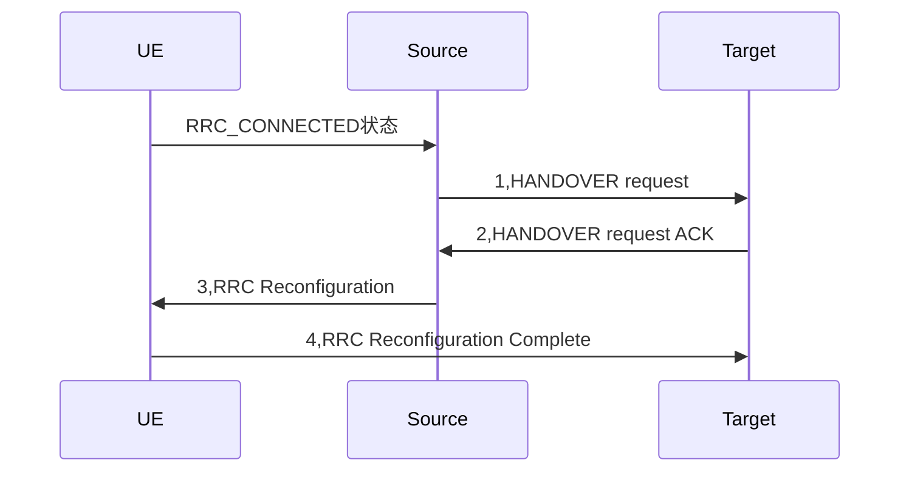
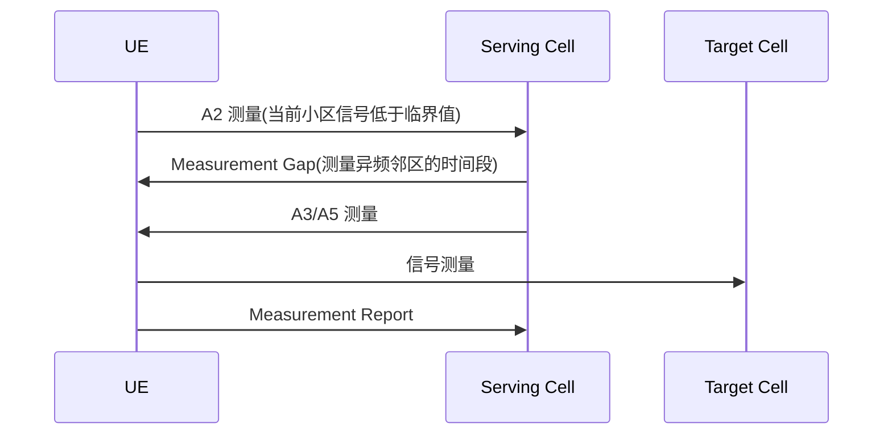
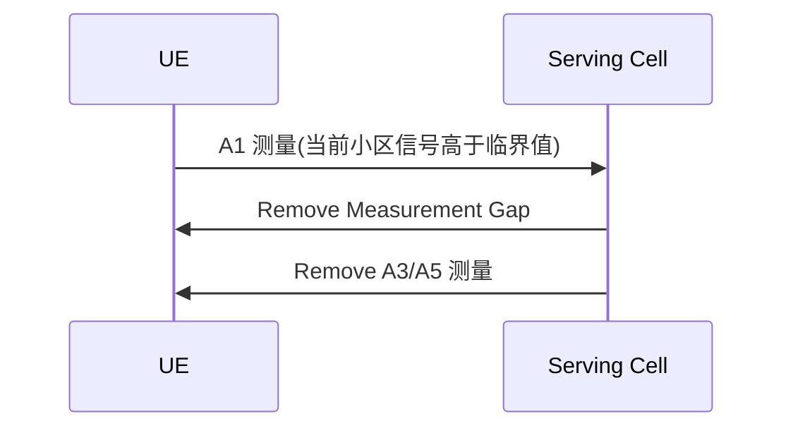

# 3GPP相关流程

#### 23.502 的 4.9 关于HO的基本描述和流程

#### 38.300 的 9.2.3 关于处于RRC_CONNECTED状态下的HO

## 3GPP关于HO的描述

	根据3GPP 23.502的4.9章：
	
	HO的基本描述

* UE可以通过Xn进行source gNB和target gNB之前的切换
* UE可以以N2（NGAP）为参考点进行切换
* 切换可以通过信道条件、负载均衡、特殊服务（有QOS flow的语音通话）来触发
* source可以从NR切换到EUTRA

#### 基于inter-gNB的Xn的HO

	基本描述：

> - HO时有或者没有UPF的重新分配
> - Xn的HO只支持同AMF的Mobility
> - 如果HO到一个共享的网络中，并且Serving PLMN改变了，source应该告诉target改用哪个PLMN
> - 如果HO过程中，AMF发送的DL信令消息被gNB拒绝了，那么应该等到HO成功或者失败了再次发生
> - 如果HO过程中，SMF发送的信令消息被AMF拒绝了，那么应该等到HO成功或者失败了再次发生

​	

#### Intra-NR的HO分类

​	

> * UE处于RRC_IDLE下：
>   * 对cell的选择
>   * 对cell的重选
> * UE处于RRC_INACTIVE下：
>   * 对cell的重选
>   * 基于gNB的通知区域
>   * RNA 更新
> * 处于RRC_CONNECTED状态下的：
>   * Handover（CP处理，UP处理，数据转发）
>   * Re-establishment流程
>   * 基于竞争的HO

#### 706：基于RRC_CONNECTED 的HO流程

​	

	connected状态下的HO分为cell级别和beam级别的。

    1，Source 通过Xn告知Target要HO
    2，Target gNB进行Admission Control并回复ACK给Source，并且带有RRC Reconfiguration消息
    3，Source将ACK中带有的RRC重配消息带给UE，其中包括了cell id和一些用于接入Target的IE，这样UE就不必去检测SIB
    4，UE向Target建立RRC连接，并且回复Complete消息

​	

### 3GPP关于测量的描述

	基本描述：

> * 测量必须发生在UE连接情况下，测量有以下几种：
>   * 同频NR测量
>   * 异频NR测量
>   * 不同RAT测量（测量E-UTRA）
>   * 不同RAT测量（测量NR）
> * 对于一个测量类型，可以定义一个或多个测量目标（mesurement object，MO可以是一个待测的载波频率）
> * 对于一个MO，可以定义一个或多个报告配置（reporting configurations，报告配置定义了3种如下reporting criteria）
>   * 基于事件触发的报告
>   * 基于周期性的报告
>   * 基于周期和事件触发的报告
> * Measurement identity把一个MO和一个RC联系在一起，我们可以为一个MO和RC对 配置多个MI：
>   * 可以把多个RC对应到一个MO
>   * 可以把一个RC对应到多个MO
> * MI可以再报告测量结果时使用
> * 测量数量可以由每个RAT自己决定
> * 测量命令可以由gNB下发给UE（开始，停止，修改）
> * HO可以发生在GNB之间，CN之间，RAT之间（可以包含CN的HO）

#### 关于同频和异频的定义

基于SSB测量：
> * serving cell和target cell的SSB中心频点不一样就是异频，SSB的子载波间隔不一样也算异频
> * serving cell和target cell的SSB中心频点一样，并且SSB的子载波间隔一样就是算同频

基于CSI-RS的测量：
> * 测量target cell的CSI-RS资源带宽在serving cell的CSI-RS资源带宽内即是同频测量，子载波间隔也必须相同
> * CSI-RS资源和上面相反，或者子载波间隔不同就是异频测量

#### A2配置流程

A2测量

#### A1配置流程

A1测量

